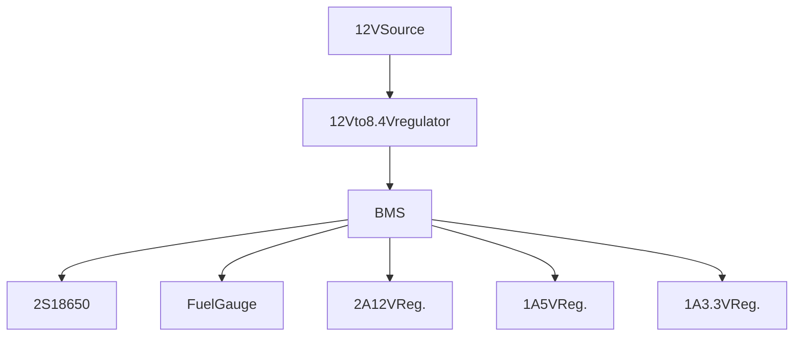

# Zdroj

| součástka                                                                              | částka | rozměr    | odběr     | napětí   | hmotnost | datasheet                                                                                   |
| -------------------------------------------------------------------------------------- | ------ | --------- | --------- | -------- | -------- | ------------------------------------------------------------------------------------------- |
| [ESP32](https://www.laskakit.cz/espressif-esp32-wroom-32-2-4ghz-wifi-bluetooth-modul/) | 118kč  | 18x19.5+6 | min. 0.5A | 3.3V     | 10g      |                                                                                             |
| !4x[TOF](https://www.laskakit.cz/laserovy-senzor-vzdalenosti-gy-vl53l0x-i2c/)          | 4x68kč |           |           | 3-5V     |          | [datasheet](file:///home/radek/Downloads/vl53l0x.pdf)                                       |
| [https://www.laskakit.cz/gy-bmi160-6-osy-gyroskop-a-akcelerometr-i2c/](GY-BMI160)      |        |           |           | 1.7-3.6V |          | [datasheet](https://invensense.tdk.com/wp-content/uploads/2015/02/PS-MPU-9250A-01-v1.1.pdf) |
| TF karta                                                                               |        |           |           | 3.3V     |          |                                                                                             |
| 2xmotor                                                                                |        |           | 2x1A      | 12V      |          |                                                                                             |
|                                                                                        |        |           |           |          |          |                                                                                             |

[esp32 datasheet](https://www.espressif.com/sites/default/files/documentation/esp32-wroom-32_datasheet_en.pdf)

[Kicad tutorial](https://www.youtube.com/watch?v=SFJRHFMOhQA)

3-4x TOF
ESP32
Hbridge - motors
IMU
SD-karta
motor headers
power-unit
1/2x 18650
2x motor
3x IR sensor
sensor nárazu

boot button
reset button
pogo pins

# Rozchodit vše z laboratorního zdroje

# Přidat baterie

# Udělat DPS

